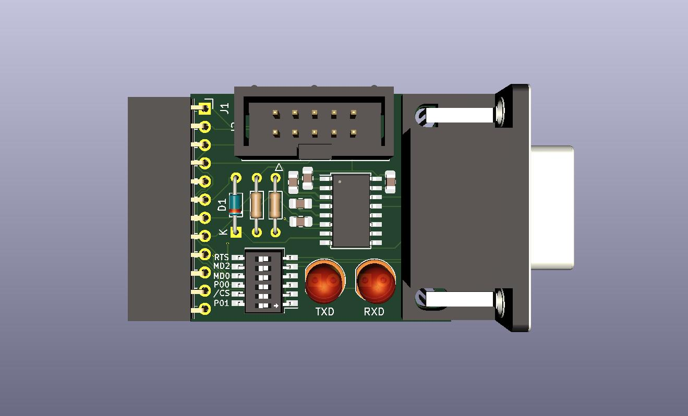

# MB9X-UART
Building this PCB would allow you to program the Fujitsu F2MC-16LX series processors using an RS-232C serial port connection. It uses a 12-pin connector for direct connection to the JVC DT-V series monitors and an optional 10-pin connection as described in Fujitsu documentation. Note: that programming the DT-V monitors requires a slight modification to the Signal PWB. 



The person assembling this board will need to procure their own USB to RS232-C cable and their own copy of the Fujitsu "FLASH MCU Programmer 16LX" software, which includes necessary proprietary info about the chips. I recommend installing [ISP-MB9X](https://isp-mb9x.sourceforge.net/) by Sergey Pinigin in addition to the Fujitsu software to have some more fine control over programming the chip.

## Example Usage
 - Identify the chip you are using and set the DIP switches accordingly
   - Settings can be found in Fujitsu documentation. The /CS and RTS switches should stay ON.
 - Connect the USB-RS232C port to the assembled MB9X-UART PCB
 - Connect the MB9X-UART to your target board, and turn on the power
 - Invoke the ISP-MB9X program from the command-line. 
   - For example: ```isp-mb9x.exe /1 /o4 /MB90F553A /b ROM.mhx /r```
uses serial port COM1 to dump the ROM from a Fujitsu MB90F553A running at 4MHz into a file called ROM.mhx
note that running the program without a command will erase the ROM from your MCU by default, so be careful!!
 - Power off your equipment and unplug the board

