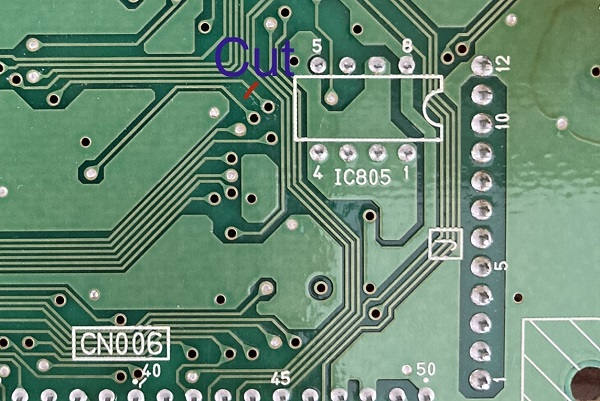
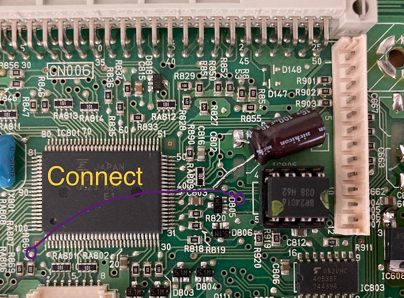
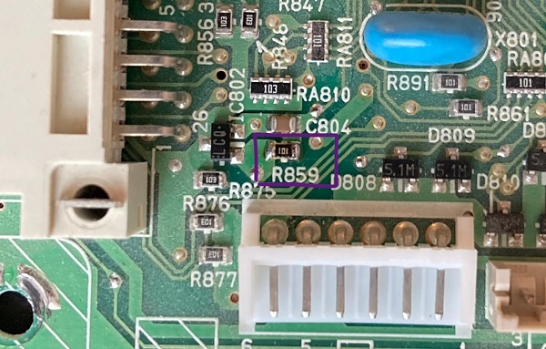
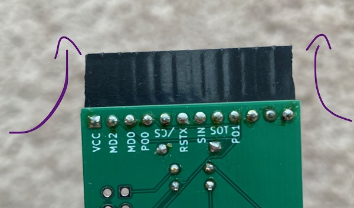
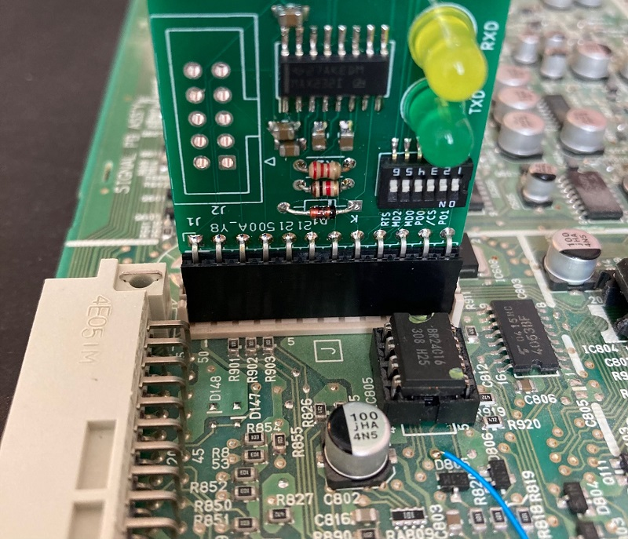

# Serial Programming mod for JVC DT-V Monitors
Some modification is needed to put the MCU in a JVC monitor into serial programming mode. 
We need a way to ground pin P01, and we will accomplish this by cutting an unused clock trace going to the 12-pin serial connector and replacing that signal with P01.
The UART-MB9X device will then be usable on the SIGNAL PWB. 

 - First, remove the 10 screws holding down the monitor cover
 - grabbing by the handles, wiggle the cover towards the back of the monitor slightly until you can see the metal lip that goes under the front bezel
 - Pull outwards from the handles to decouple the cover from the monitor and lift it straight up and away. place it where it won't be an obstacle
 - unplug the three cables from the signal PWB that go to the front button panel
 - remove the tally light cable and unplug the signal PWB from the I/O tower
 - gently remove the cables going from the signal PWB to the CRT neck board and the REMOTE board.
 - with the signal PWB now loose, place it on your workbench
 - flip it over and cut the trace shown in the following picture

 - solder a small wire from the pad above R860 to the circled hole in the PCB.
 
 
  - it may be necessary to remove resistor R859 for the MB9X-UART to deliver the reset pulse. you may reinstall it when done.
  
  
 - take your assembled MB9X-UART board and use a razor blade or file to remove 0.5mm of material from each side of the 12-pin header
 
 
 - do this slowly and carefully until the MB9X-UART fits into connector J without too much force. a little force is OK.
 - Your signal board is now ready to be read/programmed. 
  - You can do this from the monitor service menu (untested) or using an external 5V supply plugged into the 3-pin connector C (preferred)
   - pin 2 is +5V and pin 3 is GND

see the main readme for the command needed to dump the ROM. All the DIP switches should be set to ON.
